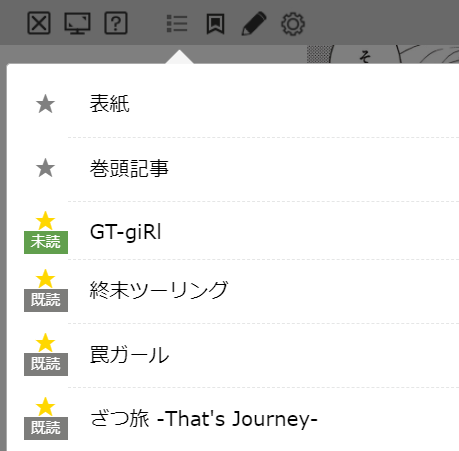

# bw_favlist
BOOK☆WALKER読み放題のお気に入り連載を管理する**非公式Chrome拡張機能**です。

# 使い方
1. [chrome://extensions/](chrome://extensions/)を開く
2. 右上のデベロッパーモードをONに
3. 「パッケージ化されていな拡張機能を読み込む」を選択
4. git clone（もしくはダウンロード）してきたフォルダーを選択
5. 読み放題雑誌で目次を開くと以下のスクショのような★と未読・既読マークが追加されます。

★を押すとその連載がお気に入りに追加され、未読・既読マークが表示されるようになります。  
これで公式の「連載お気に入りリスト」へ追加できない連載や新連載を次号読み忘れてしまうというようなことが起きにくくなるかと思います。  
また全角半角の表記ブレにもある程度対応していますが、目次の連載タイトル自体が変わってしまった場合はこちらの拡張機能でも対応することができませんのでご了承ください。

# 今後のアップデート
読み忘れ防止のために、読み放題期限間が迫っている雑誌がある場合は通知するような機能を検討中です。
